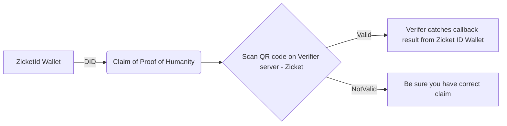
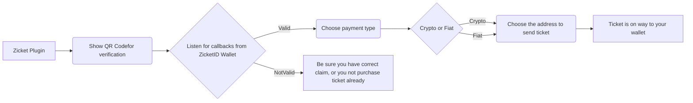

# Zicket - the anon buyer's ticket

## About

Zicket is a solution to the scalping problem raised by Vitalik Buterin at ETH Mexico 2022 (https://www.youtube.com/watch?v=rp3cDq2LiBM). Currently, people can buy multiple conference tickets at once, which is a problem because it encourages ticket misuse and allows bots to resell tickets at inflated prices. Our solution uses zk proofs to allow buyers to remain anonymous, while also limiting ticket orders to one per person and making the tickets non-transferable. Our goal is to prevent ticket scalping and protect buyers' privacy.

A good example of reselling gone wrong is group of people managed to trick the system for EthCC, purchasing 200 tickets with a plan to resell them. But when the conference organisers stripped the NFTs of their metadata, the resellers realised that the plan had fallen apart. They spent about $68k for 200 tickets that were useless (https://rekt.news/ethcc-detychey-vs-touts/).

## Problem Statement

The problem we're addressing is the tension between buyers who want to remain anonymous when purchasing event tickets and organizers who need to ensure that the person using the ticket is the original buyer. Current solutions that can be integrated into ticket-selling platforms without compromising privacy are limited, which is why we created Zicket to tackle multiple issues at once.

## Solution

Zicket is a plugin that can be integrated into any ticket-selling platform. It enables buyers to remain anonymous by using zk proofs generated using PolygonID. To be sure, that the DID from our ZicketID Wallet is correct we use Merkle tree, that stores hashes of private keys of the corresponding DIDs. To prevent the purchase of more than one ticket, we have second Merkle tree, which is used to input the hash of the private key after the ticket has been successfully purchased. It also verifies whether the buyer already has a ticket, and if they do, they cannot purchase another one. Tickets are then sent to the buyer's wallet and made non-transferable, preventing reselling and protecting buyers from inflated prices.

## How we used Polygon

We used the Polygon Flutter SDK to create an Identity Wallet that stores the Proof of Humanity claim and the Proof of ticket purchase, which is not in the set of nullifiers. By using Polygon, we ensure that Zicket is efficient, scalable and provides an easy and simple buyer flow from registration to the ticket claim.

Link to the extended Polygon ID Wallet also known as Zicket ID Wallet: https://github.com/marija-mijailovic/zicket-polygonid-flutter-sdk.git

## Tech Architecture 





## :tada: Demo Video :tada:

Pre-requisites:
- Event organizers must create an event
- Buyers must have Proof of Humanity Claims
- Buyers must have enough crypto on their wallets to purchase the ticket

Click for the image bellow for demo video:

<a href="https://drive.google.com/uc?export=view&id=12kLtH3t56qFu3jIyF0PlwRYto6ldDIh0"></a>

## Tech Stack

- PolygonID
- ZK Proofs
- Circom
- Solidity
- WAGMI
- node.js

## How to run 

- Navigate to ui/ 
- Set up .env.local, you can look for example in .env.example
- Run:
```bash
    yarn
    yarn run dev
```

## What's next

The next step is creating a perfect flow for Zicket. This would mean: 

- Oboarding real companies that provide Proof of Humanity Credentials.  

- Integrate Zicket into ticketing platforms.

- Users will use Zicket ID wallet and have claims as well as ticket NFTs in their wallets.


